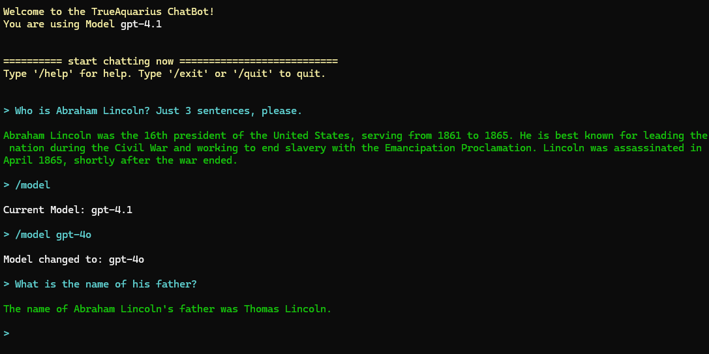

# Hello.ChatBot  

This is a simple Chatbot using **Azure OpenAI**. It runs in your Console.  

## Features  
- Chat with your Azure OpenAI instance from your Console  
- Switch between different models (more precisely: switch between different deployments) with the `/model` command.  
- Chat history; length of history can be set with `\history` commad.  
- Get help with `\help` command  


## Screenshot  
- The following screenshot shows the start of a chat. The user asks a question; the bot answers.
- Then the user inquires which model is being used.
- The user changes the model
- the user asks another question

  


## Requirements

You need to have an Azure OpenAI account and create at least one deployment. Set the api key and enpoint in your environment variables as explained below.

## Installation

You need to set the following environment variables:

In the Console:
```powershell
setx AZURE_OPENAI_API_KEY "[your Azure OpenAI key]"
setx AZURE_OPENAI_ENDPOINT "[your Azure OpenAI endpoint URL]"
```

In PowerShell:
```powershell
[System.Environment]::SetEnvironmentVariable("AZURE_OPENAI_API_KEY", "[your Azure OpenAI key]", "User")
[System.Environment]::SetEnvironmentVariable("AZURE_OPENAI_ENDPOINT", "[your Azure OpenAI endpoint URL]", "User")
```

The default deployment name right after setup is 'gpt-4o'. If your deployment name in Azure is different, you can change it using the `/model` command:

```
/model [your deployment name]
```

## How to use it
Type any prompt and get an answer from Azure OpenAI.

Change settings with `/`-commands. Type `/help` to get list of commands.

enjoy it!!!


