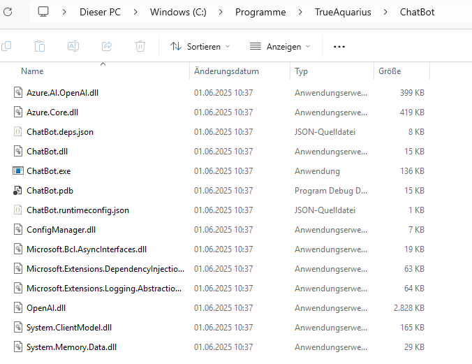
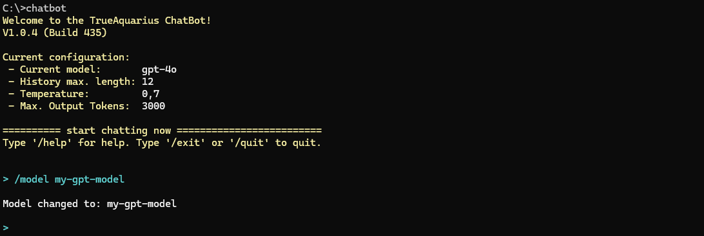

# Hello.ChatBot  

This is a simple Chatbot using **Azure OpenAI**. It runs in your Console.

Like all my "Hello"-projects, this is a "Hello World" version of a chat bot, meaning that it is meant to be an experiment and not meant to be for production. However, it has evolved into a quite useful tool. It is good for those people who want to user their own instance of OpenAI without going through commercial portals such as ChatGPT.

## Features  
- Chat with your Azure OpenAI instance from your Console  
- Switch between different models (more precisely: switch between different deployments in Azure AI) with the `/model` command.  
- Chat history; length of history can be set with `/history` command.  
- Get help with `/help` command  


## Screenshot  
- The following screenshot shows the start of a chat. The user asks a question; the bot answers.
- Then the user inquires which model is being used.
- The user changes the model
- the user asks another question

  


## Requirements / Prerequisites

- You need to have an Azure OpenAI account and create at least one deployment of a large language model (LLM). Set the api key and endpoint in your environment variables as explained below.

## Installation
### 1. Set environment variables
You need to set the following environment variables, so that the chat bot can connect to Azure Open AI:

#### Option 1: In the Console:
```powershell
setx AZURE_OPENAI_API_KEY "[your Azure OpenAI key]"
setx AZURE_OPENAI_ENDPOINT "[your Azure OpenAI endpoint URL]"
```

#### Option 2: In PowerShell:
```powershell
[System.Environment]::SetEnvironmentVariable("AZURE_OPENAI_API_KEY", "[your Azure OpenAI key]", "User")
[System.Environment]::SetEnvironmentVariable("AZURE_OPENAI_ENDPOINT", "[your Azure OpenAI endpoint URL]", "User")
```

You may have to restart your terminal before the new environment variables come into effect.

### 2. Install Application

- In GitHub, go to [Releases](https://github.com/TrueAquarius/Hello.ChatBot/releases).
- Pick the most recent release.
- Download the app.zip file.
- Create a new folder on your computer, for example '`C:\Program Files\TrueAquarius\ChatBot`'
- Copy all files from the '`publish`'-folder within `app.zip` to that new folder.
- Add the new folder to your PATH environment variable

You may have to restart your terminal before the new PATH comes into effect.

Your folder should look like this:

  


### 3. Start Application

In your terminal start your application `chatbot`.

The default deployment name right after setup is 'gpt-4o'. If your deployment name in Azure is different, you can change it using the `/model` command:

```
/model [your deployment name]
```

  


## Configure Application

All configurations are stored in a configuration file. That file is usually located here:
```powershell
C:\Users\[user]\AppData\Roaming\TrueAquarius\ChatBot\Configuration.json
```
The file can be edited with any editor. It looks somewhat like this:
```json
{
  "DeploymentName": "gpt-4o",
  "HistoryLength": 12,
  "Temperature": 0.7,
  "MaxOutputTokenCount": 3000,
  "SystemPrompt": "You are a helpful assistant. Please answer the user\u0027s questions to the best of your ability."
}
``` 
Some configuration settings can be changed directly within the chatbot:
- Command `/model [my-model]` changes the `DeploymentName`.
- Command `/history [length]` changes the `HistoryLength`.
- Command `/Temperature [value]` changes the `Temperature`.
- Command `/token [count]` changes the `MaxOutputTokenCount`.


## How to use it
Type any prompt and get an answer from Azure OpenAI.

Change settings with `/`-commands. Type `/help` to get list of commands.

**Enjoy it!!!**


## How to make new release
Building a release is supported by an GitHub Action ([release.yml](.github/workflows/release.yml)), which gets triggered when a `git push` contains a tag which starts with the letter '`v`' like '`v1.0.0`'.

Extract form [release.yml](.github/workflows/release.yml):
```yml
on:
  push:
    tags:
      - 'v*'
```

In Visual Studio 2022, open a new terminal. Create a new tag with the release number:
```powershell
git tag -a v1.0.0 -m "Release version 1.0.0"
```
Make a local commit. Then push from terminal with tag number:
```powershell
git push origin v1.0.0
```